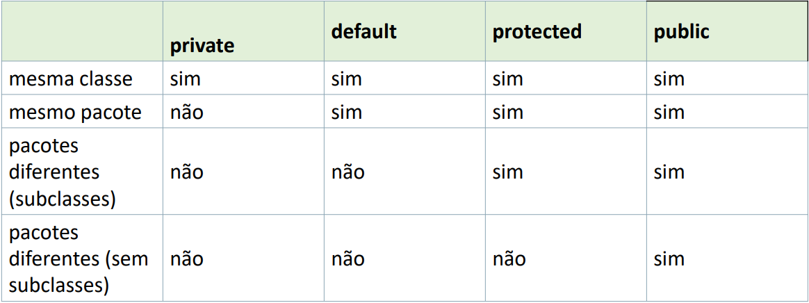

# Professor: Edjane Azevedo
#### Data: 22 de Abril de 2024
#### Encapusulamento.

* Existe 5 tipos de encupusalamntos

#### Public: 
• Qualquer lugar pode acessar e qualquer entidade.

#### Private:
• Os menbros da classa não podem acessar ou serem acessodos e usados outras classes.

#### Protected:
• È acessivel por classes do mesmo pocote.
• Seus membros herdados não são acessiveis por outras classes.

#### default
A classe e/ou seus membros são acessíveis somente por classes do 
mesmo pacote;

#### final
• Não permite estende-la;
• Não pode ser alterado depois que já tenha sido atribuído um valor.

#### abstract
• Não é aplicado nas variáveis, apenas nas classes; 
• Não pode ser instanciada.

#### static
• Usado para a criação de uma variável que poderá ser acessada por 
todas as instâncias de objetos da classe

### Resumo

